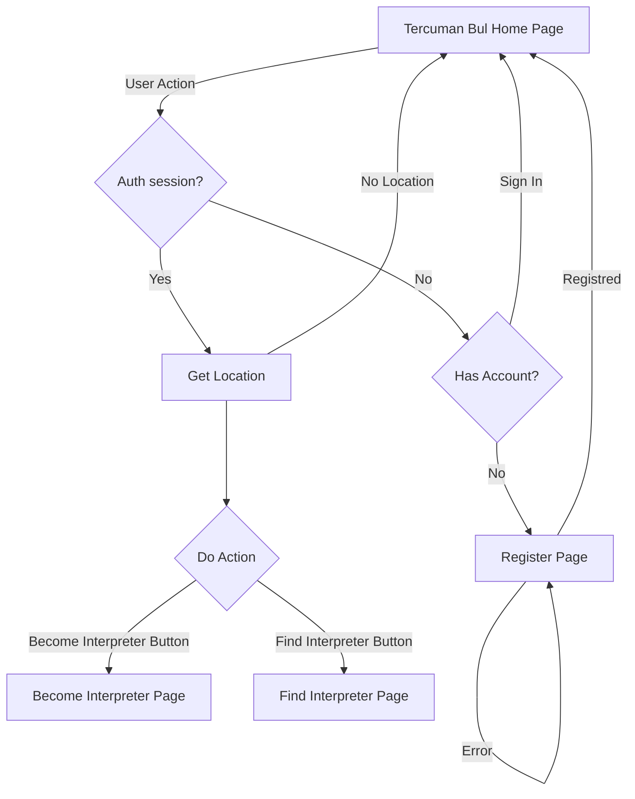

# Tercüman Bul Projesi

## Proje Yönetimi

Trello: https://trello.com/b/oYNRO4zf/tercuman-bul
Discord: https://discord.gg/itdepremyardim

## Amaç

Türkiye'deki büyük depremde farklı dillerde konuşan depremzedeler ve yardım sağlayan ekipler arasındaki iletişimi kolaylaştırmak.

## Proje Kapsamı

Uygulama ile tercümanlar ve kullanıcıların veritabanına kaydolması, veritabanında bilgilerinin saklanması ve depremzedelerin veya diğer kullanıcıların tercümanlarla iletişim kurması amaçlanmaktadır.

### Projenin Adımları:

1. Tercüman ve kullanıcı, isim, telefon ve konum bilgileri ile sisteme kaydedilir.
2. Tercümanın ve kullanıcının, Aydınlatma Metni onayı ile bilgileri veritabanına eklenir.
3. Depremzedeler veya diğer kullanıcılar, uygulamayı kullanarak tercümanın bilgilerini alır.
4. Tercümanın haritada ismi, konumu, telefon numarası görülür
   ve aranabilir, mümkünse depremzedenin yanına gider. Eğer mümkün
   değilse telefon üzerinden çevrimiçi iletişim sağlanabilir.
5. Harici iletişim bilgileri (örneğin sosyal medya platformları)
   incelenebilir ve harici platform üzerinden iletişim kurulabilir.

## Kullanılan Teknolojiler:
- Flutter 
- Firebase
  - Firestore (database)
  - Hosting (Desktop+Mobile Web App)
  - Authentication


# Teknik

> ÖNEMLI NOT! PROJEYİ ÇALIŞTIRIR KEN PORT 3000 KULLANINIZ!

## App Flow


## Kurulum

Kuruluma başlarken Flutter SDK'in yüklü olduğu ve reponun klonlandığı varsayılmaktadır.

### Mac

Mac için doğrudan bir installer hazırlandı. [install.sh](./install.sh) kullanarak doğrudan çalıştırılabilir.

### Diğer işletim sistemleri:

Komut satırından repo kök dizinine gittikten sonra:

```sh
flutter upgrade
flutter pub get
flutter run
```

Not: Bağımlılıkları yüklerken Windows için Geliştirici modunu açmanız gerekebilir: `start ms-settings:developers` komutunu kullanabilirsiniz.

### Lisans:
Bu proje MIT Lisansı altında lisanslanmıştır - ayrıntılar için [lisans](LICENSE) dosyasına bakın.
